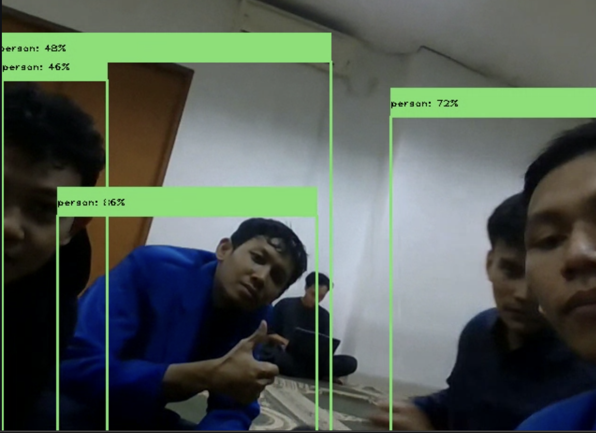
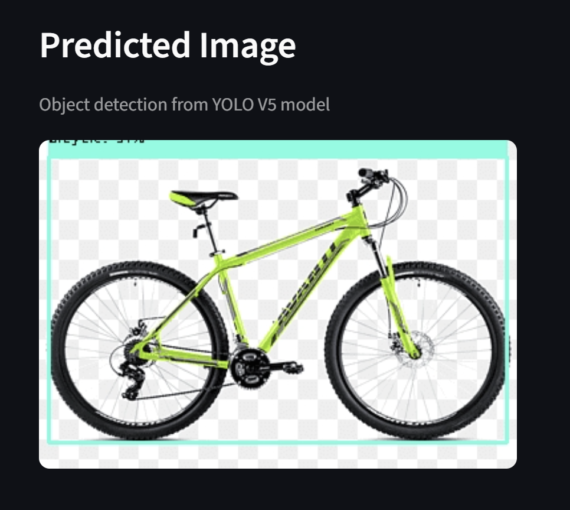

# 🧠 YOLOv5 Object Detection WebApp

# Ujian Akhir Semester  
## Pengolahan Citra Digital  
### Kelompok 7

| NIM        | Nama                        |
|------------|-----------------------------|
| 312310043  | Akmal Fauzan                |
| 312310016  | Bagus Tri Ardiawan          |
| 312310064  | Dimas Setya Budi            |
| 312310029  | Moch. Alwi                  |
| 312310779  | Rizki Andriyono Pratama     |


---

YOLOv5 Object Detection WebApp
Sebuah aplikasi web interaktif untuk melakukan deteksi objek menggunakan model **YOLOv5**. Aplikasi ini dapat mendeteksi objek pada **gambar statis** maupun secara **real-time** menggunakan **webcam**, dengan antarmuka yang dibangun menggunakan **Streamlit**.

---

## 🚀 Fitur Utama

- 🔍 Deteksi objek dari gambar yang diunggah
- 📸 Deteksi objek secara langsung melalui webcam (real-time)
- 🎯 Menggunakan model YOLOv5 dalam format ONNX
- 🌐 Aplikasi berbasis web menggunakan Streamlit
- 📊 Menampilkan label objek dan confidence score

---

## 🗂 Struktur Proyek

```
4_webapp/
├── Home.py                   # Halaman utama Streamlit
├── yolo_predictions.py       # Fungsi prediksi menggunakan model YOLO
│
├── models/                   # Model YOLO dan konfigurasi
│   ├── best.onnx             # Model terlatih dalam format ONNX
│   └── data.yaml             # Konfigurasi label kelas
│
├── pages/                    # Halaman-halaman tambahan
│   ├── 1_YOLO_for_image.py   # Deteksi objek dari gambar
│   ├── 2_YOLO_webrtc.py      # Deteksi real-time (WebRTC)
│   └── 3_About.py            # Informasi tentang aplikasi
│
├── images/                   # Ikon dan ilustrasi antarmuka
│   └── ...
```

---

## ⚙️ Cara Menjalankan Aplikasi

### 1. Clone atau Ekstrak Proyek

```bash
cd 4_webapp
```

### 2. (Opsional) Buat Virtual Environment

```bash
python -m venv venv
source venv/bin/activate      # Linux / macOS
venv\Scripts\activate         # Windows
```

### 3. Install Dependencies

```bash
pip install -r requirements.txt
```

### 4. Jalankan Aplikasi

```bash
streamlit run Home.py
```

---

## 📦 Requirements

Berikut pustaka Python yang dibutuhkan. Simpan sebagai `requirements.txt`:

```
streamlit
opencv-python
onnxruntime
numpy
Pillow
streamlit-webrtc
```

---

## 🖼 Contoh Deteksi
- Kamera (YOLO WebRTC)
  
  
- Gambar statis (YOLO for image)
  
 
---

